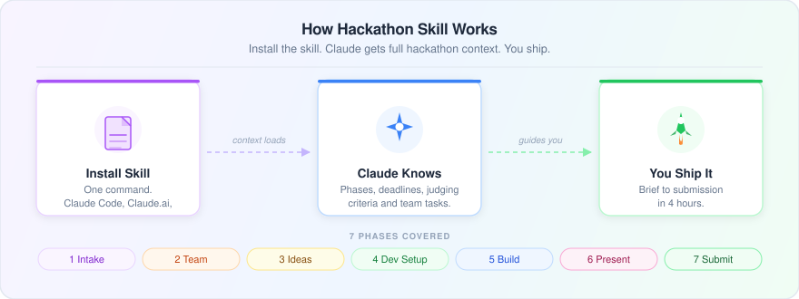

# Hackathon Skill


**Go from "we have a hackathon" to "we just submitted" -- without losing momentum.**

Most hackathon teams lose hours to coordination overhead: picking ideas, setting up repos, figuring out who does what. This skill gives Claude the full context it needs to be a real co-pilot -- not just a code completer. Tell it about your hackathon. It handles the rest, one phase at a time.

Made by [Ian Too](https://iantoo.space)

---

## How It Works



---

## What You Get

Once installed, Claude walks you through every phase in order:

| Phase | What Happens |
|-------|-------------|
| 1. Intake | Paste a URL or text -- Claude reads the brief and summarizes requirements |
| 2. Team Formation | Collect names, roles, and GitHub handles. Get a clean team roster |
| 3. Idea Selection | Each member shares an idea. Claude scores them and recommends one |
| 4. Dev Setup | Repo structure, git commands, and tasks broken down per person |
| 5. Build | On-demand help with code, bugs, and integration |
| 6. Presentation | Slide outline and talking points tailored to your judging criteria |
| 7. Submission | Checklist, artifact drafting, and a submission-ready README |

## Team Mode

This skill is designed for teams working in parallel:

1. One member creates the GitHub repo and commits the skill
2. Each teammate installs it in their own Claude Code session
3. Everyone works with Claude at the same time -- the repo is the shared source of truth
4. Phase outputs (TEAM.md, IDEA.md, TASKS.md, etc.) get committed and stay visible to all

---

## Installation

Pick the option that matches your setup:

### Claude Code (terminal)

```bash
claude skills install https://shipables.dev/skills/hackathon
```

### Claude.ai (browser)

1. Go to [claude.ai](https://claude.ai) and open any conversation
2. Click the **Skills** icon in the sidebar (or go to Settings > Skills)
3. Click **Add Skill** and paste this URL:
   ```
   https://shipables.dev/skills/hackathon
   ```
4. Click **Install** -- the skill will be available in all your conversations

### Cursor, Copilot, and other compatible agents

Most agents that support Agent Skills use the same install command:

```bash
npx @senso-ai/shipables install hackathon
```

Or check your agent's skill settings and paste the Shipables URL directly.

### Manual install (any agent)

1. Download `SKILL.md` from this repo
2. Place it in your project under `.claude/skills/hackathon/SKILL.md`
3. Restart your agent session -- it will pick up the skill automatically

---

## Usage

Just start talking:

> "We have a hackathon this weekend, help us get organized."
> "I'm doing a solo hackathon, here's the brief: [paste]"
> "We're mid-hackathon and need to pick an idea."

Claude will detect where you are and jump into the right phase.

## Files

```
hackathon-skill/
├── SKILL.md                    -- Main skill (all 7 phases)
├── how-it-works.svg            -- Diagram
├── README.md                   -- This file
└── references/
    ├── github-setup.md         -- Git commands for repo and collaborator setup
    └── phase-templates.md      -- Ready-to-commit markdown templates
```

## Requirements

- Works in Claude Code, Claude.ai, and any coding agent that supports skills
- GitHub CLI (`gh`) optional but recommended for repo creation
- No other dependencies

---

Made with love for hackers. Ship something great.
